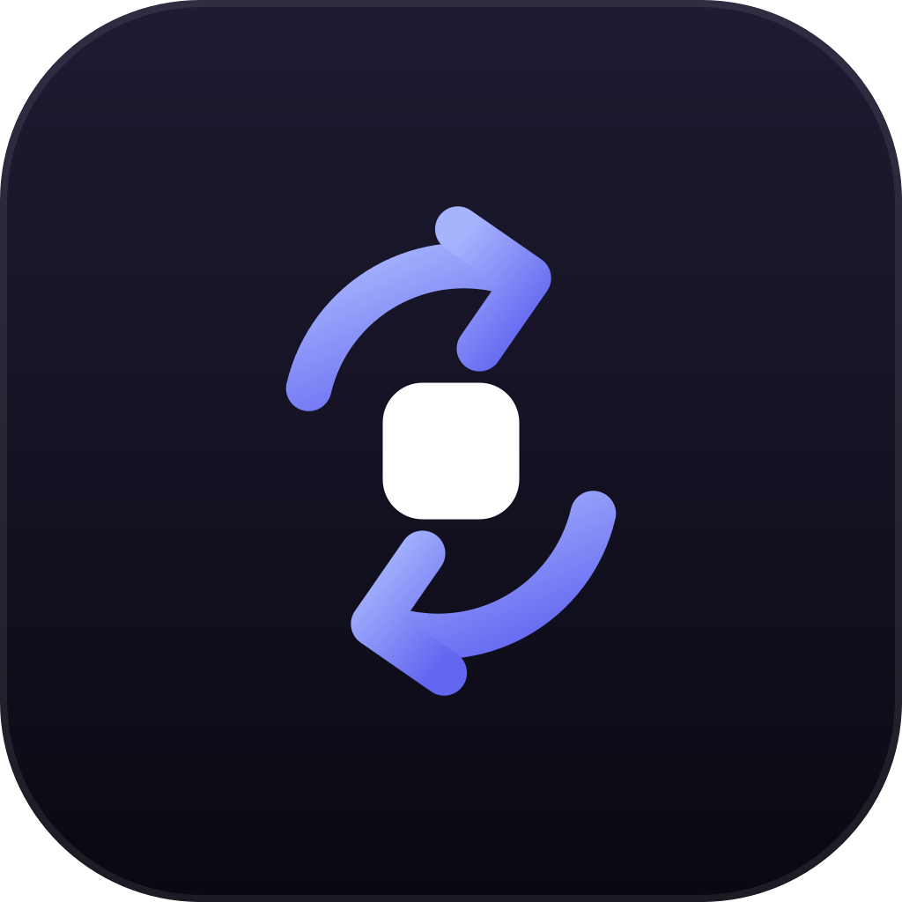

# Postillion

Control your coding agents (Claude Code, Codex, Cursor, Grok, Hermes, Pi) locally by default, with optional multi-device sync.

Every device runs a small engine that stores sessions on that device. A new installation starts in local-only mode without an account or a network connection.

Postillion is built on [zeronsh/comet](https://github.com/zeronsh/comet), rebuilt on GPUI. `main` starts from a single squashed import of upstream — the unsquashed history is upstream's own, at [zeronsh/comet](https://github.com/zeronsh/comet). The pre-GPUI Tauri version is on the [`v1-tauri`](https://github.com/WinTone01/postillion/tree/v1-tauri) branch and tag.

## Install

There is no hosted installer. Build from source or take a build from
[Releases](https://github.com/WinTone01/postillion/releases).

```bash
cargo build --release -p postillion
./target/release/postillion status
```

Day-to-day:

```bash
postillion status      # local/synced mode and engine status
postillion daemon start|stop|restart|status
```

On **macOS**: build `postillion` from source and run `postillion daemon install` to install the launchd service.

On **Windows**: download the release zip and run `Install.ps1` (per-user, no admin rights). It installs into `%LOCALAPPDATA%\Programs\Postillion`, adds a Start Menu shortcut, and puts the directory on your user PATH. There is no background service on Windows — the desktop app runs the engine in-process, and `postillion update` reports new versions rather than applying them, so update by re-running `Install.ps1` from the newer zip.

## Optional multi-device sync

Postillion ships **no hosted sync endpoint**. A bare install is local-only and stays that way until you point it at a server you run yourself:

```bash
export POSTILLION_EDGE_URL=https://sync.your-domain.example
```

[`deploy/`](deploy/) has everything needed to run `postillion-server` on your own machine, via Coolify or systemd. Hosted sign-in additionally needs your own WorkOS AuthKit tenant in `POSTILLION_WORKOS_CLIENT_ID`.

Once an endpoint is configured, sign in only when you want to open your account's synced workspace. Authentication changes the profile selected by the next engine start, so stop the daemon before changing it:

```bash
postillion daemon stop
postillion login
postillion daemon start
```

You can then start an agent on one synced device and follow or drive it from another. An always-on machine such as a VPS can keep those agents working after you close your laptop.

Signing in does not upload, move, or import existing local sessions. Local sessions and their attachments remain under the local profile and reappear when you return to local-only mode:

```bash
postillion daemon stop
postillion logout
postillion daemon start
```

`postillion login` and `postillion logout` refuse to modify credentials while an engine owns the data directory. The desktop app follows the same next-restart profile boundary.

## Platform support

| | Linux | macOS | Windows |
| --- | --- | --- | --- |
| Desktop app | yes | yes | builds and runs; GPU path not yet verified on real hardware |
| Background service | systemd | launchd | none — engine runs in-process |
| Self-update | yes | yes | reports only |

See [docs/PARITY.md](docs/PARITY.md) for the per-platform gaps.

---

Developing or curious how it works? See [ARCHITECTURE.md](ARCHITECTURE.md).

Licensed under the [MIT License](LICENSE). Portions copyright the upstream Comet authors.
