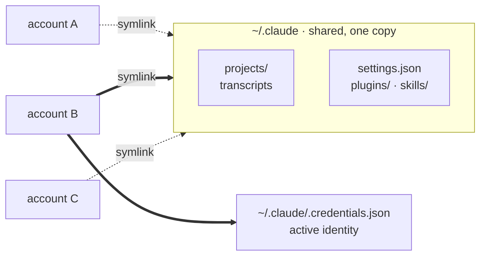

<div align="center">


<br>

**A desktop client for Claude Code that lets you switch accounts mid-conversation.**

Pick up any past session under a different account and keep going —
same context, same history, no re-explaining.

<br>


</div>

---

## The idea

Claude Code stores your conversations on **your disk**, as append-only JSONL:

```
~/.claude/projects/<cwd-slug>/<sessionId>.jsonl
```

Those transcripts contain `sessionId`, `cwd`, `gitBranch` and timestamps.
They contain **no account identity at all**. The API is stateless per turn —
the whole history is resent on every request — so there is no server-side
conversation tied to whoever you happened to be logged in as.

Which means the account is just the thing paying for the next turn. Swap it and
the conversation carries on.

> [!IMPORTANT]
> This does **not** apply to claude.ai web chats. Those live on the server and
> are tied to your account. Postillion covers Claude Code sessions only.

<br>

<div align="center">

| | |
|:--|:--|
| 🔄 **Cross-account resume** | Same transcript, different account, context intact |
| 📊 **Usage meter** | Session and weekly limits per account, and when they renew |
| 💬 **Chat UI** | Streaming markdown, live thinking blocks, real code diffs |
| 🖼️ **Images** | Region screenshot, paste, drag-drop — straight to the model |
| ✅ **Batched approvals** | Clear everything pending at once, or trust a tool for the session |
| ⚙️ **Background processes** | See what Claude is running, stop any of it |
| 🔌 **Per-chat MCP** | Pick which servers a conversation gets |
| 🧩 **Plugins & skills** | Marketplaces, install, toggle, create |
| ⌨️ **Command palette** | `Ctrl+K` across sessions, accounts and actions |
| 🌍 **Bilingual** | Follows your system locale, overridable |

</div>

---

## Install

Requires [Claude Code](https://claude.com/claude-code) on your `PATH`, Node 18+
and a Rust toolchain.

```bash
git clone https://github.com/WinTone01/postillion
cd postillion
./scripts/install.sh
```

The script rebuilds the release binary, then installs it to `~/.local` along
with a desktop entry and icons — no root, no packaging tools.

<details>
<summary><b>Options</b></summary>

<br>

| Flag | Effect |
|---|---|
| `--no-build` | Reuse the existing binary instead of rebuilding |
| `--system` | Install to `/usr/local` |
| `--prefix PATH` | Install somewhere else |

Rebuilding is the default so an install always ships current sources.

</details>

<details>
<summary><b>Uninstall</b></summary>

<br>

```bash
./scripts/uninstall.sh
```

Only files the installer created are removed. `~/.claude` — your sessions,
credentials and settings — is never touched. Extra accounts in
`~/.claude-accounts` survive too unless you pass `--purge-accounts`.

</details>

<details>
<summary><b>Development</b></summary>

<br>

```bash
npm install
npm run tauri dev        # hot reload
npm run check:i18n       # translation coverage
cd src-tauri && cargo test
```

</details>

---

## How your accounts are stored

Nothing is moved. Your existing `~/.claude` becomes the `default` account and
owns the shared data; extra accounts symlink back to it and carry only their own
credentials.



Switching rewrites one credentials file, so it is **system-wide** — the `claude`
command in your terminal follows along. That is deliberate, and it is why the UI
refuses to switch while a session is running.

📖 **[Read how it works →](docs/how-it-works.md)** — the undocumented flags, the
control protocol, the `CLAUDE_CONFIG_DIR` trap, and what was measured to find
each of them.

---

## Documentation

| | |
|---|---|
| 📖 [**How it works**](docs/how-it-works.md) | Account isolation, the headless protocol, permissions, usage limits |
| 🏗️ [**Architecture**](docs/architecture.md) | Layers, the transcript scanner, the stream adapter, localisation |
| ⚠️ [**Platform notes**](docs/platform-notes.md) | WebKitGTK, Wayland, CSP, screenshots, and the known limits |

---

## Name

A *postillion* rode the lead horse at a post station. Horses were swapped and
the rider changed — the message kept moving.

---

<div align="center">
<sub>

Not affiliated with Anthropic. "Claude" is a trademark of Anthropic.

</sub>
</div>
