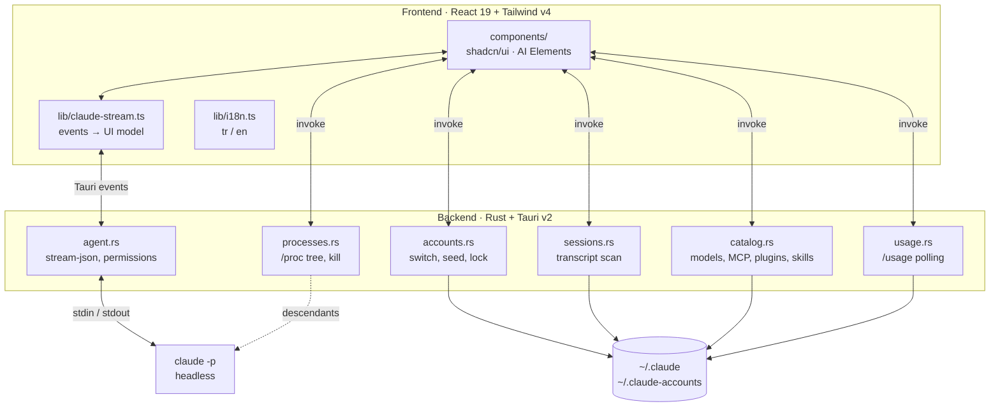

# Architecture

[← back to the README](../README.md)

---

## Layers



| Layer | File | Responsibility |
|---|---|---|
| Paths & validation | `src-tauri/src/paths.rs` | Layout, binary resolution, path-traversal defence |
| Account lifecycle | `src-tauri/src/accounts.rs` | Create / seed / repair / delete, locking |
| Transcript scanning | `src-tauri/src/sessions.rs` | JSONL parsing, head+tail sampling, cache |
| Agent driver | `src-tauri/src/agent.rs` | stream-json, permission control channel |
| Catalog | `src-tauri/src/catalog.rs` | Models, MCP, plugins, marketplaces, skills |
| Usage | `src-tauri/src/usage.rs` | `/usage` parsing and per-account cache |
| Processes | `src-tauri/src/processes.rs` | `/proc` descendant tree, signalling |
| Screenshots | `src-tauri/src/screenshot.rs` | Region capture through the desktop's own picker |
| Stream adapter | `src/lib/claude-stream.ts` | Claude events → UI model |
| Localisation | `src/lib/i18n.ts` | `t()`, relative time, percent placement |
| UI | `src/components/` | React, shadcn/ui, AI Elements |

---

## Scanning 400 MB of transcripts

Two optimisations keep session listing responsive:

1. **Head + tail sampling.** Files over 1 MiB are read 128 KB from the start and
   256 KB from the end. Title records repeat throughout the file and *last one
   wins*, so the tail is enough; `sessionId` and `cwd` live at the head.
2. **`(path, mtime, size)` cache.** For append-only files an unchanged triple
   means unchanged content.

Measured: **108 sessions in 913 ms** across 412 MB.

Sub-agent transcripts (`<sessionId>/subagents/agent-*.jsonl`) are skipped on
purpose — they are not standalone sessions and cannot be resumed.

---

## Stream adapter

Deltas and complete messages are never merged. The `assistant` event is the
single source of truth; `stream_event` deltas only feed the typing preview and
are discarded once the full message lands. Otherwise the same text accumulates
twice.

One more wrinkle: Claude splits a single assistant message across several
records that share one `message.id` — up to six in real transcripts. They are
merged, otherwise React drops duplicate keys and half the conversation vanishes.

### The typewriter

Incoming text is a *target*; what is on screen advances toward it at a capped
rate. Without the cap, a fast model's whole reply lands in one frame and the
effect never appears. Reveal commits at about 30 Hz rather than every frame,
because the revealed text is rendered as markdown and each commit is a parse.

---

## Localisation

Interface strings go through `t()`, keyed by **the Turkish source text** — the
way gettext keys by the source string. Inventing several hundred identifiers
would have made the components unreadable, and this codebase is written in
Turkish, so the source doubles as the default translation.

The trade has a cost: editing the Turkish silently drops the translation. So:

```bash
npm run check:i18n
```

compares the dictionary against every `t()` call and fails on a key that is used
but not translated. It reports unused keys too.

Detection reads only the primary language — a second entry in the list is a
fallback, not a preference. Turkish gets Turkish, everything else gets English.

---

## Testing

```bash
cd src-tauri && cargo test              # 35 unit + integration tests
cargo test --test integration -- --ignored   # live, needs a signed-in account
npm run check:i18n                      # translation coverage
npx tsc --noEmit                        # types
```

The `#[ignore]`d integration test actually runs `/usage` against your account
and asserts the parser still understands the output — the one thing a fixture
cannot catch when Anthropic changes the wording.
