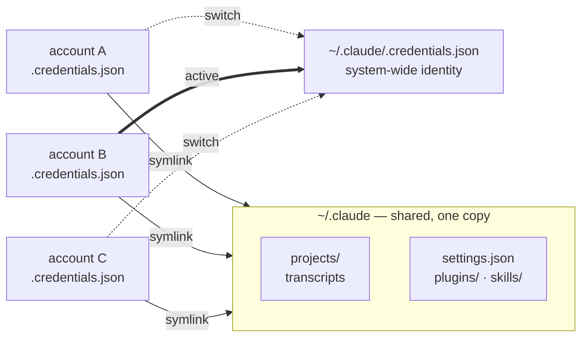
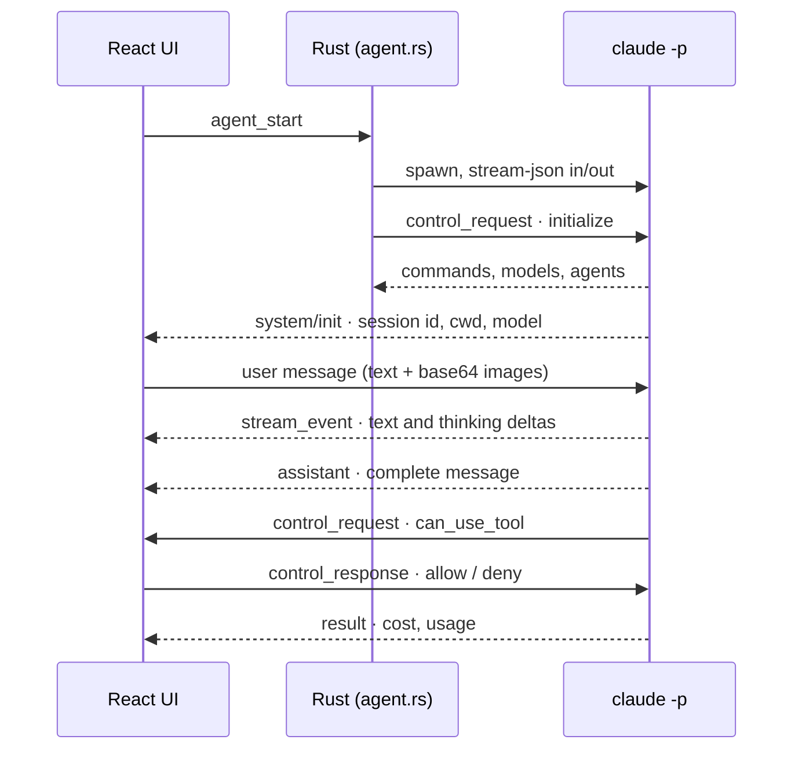

# How it works

Everything here was measured against a real Claude Code install, not read off a
spec. Where a claim came from an experiment, the experiment is named.

[← back to the README](../README.md)

---

## Why cross-account resume is possible at all

Claude Code keeps conversation context on your disk:

```
~/.claude/projects/<cwd-slug>/<sessionId>.jsonl
```

Append-only JSONL transcripts. The API is **stateless per turn** — the client
resends the whole message history on every request, so there is no server-side
conversation object to be tied to an account. Prompt caching is only a cost
optimisation (5 min / 1 h TTL, scoped to your org).

The detail that makes the whole project work: **transcripts carry no account
identity.** Records hold `sessionId`, `cwd`, `gitBranch` and timestamps —
nothing else. Switching accounts cannot break context. You only miss the prompt
cache on the first turn.

> [!IMPORTANT]
> None of this applies to claude.ai web chats. Those live on the server and are
> tied to your account. Postillion covers Claude Code sessions only.

---

## Account isolation — nothing is moved

Your existing `~/.claude` stays exactly where it is and becomes the `default`
account, owning the shared data. Extra accounts symlink back to it.

```
~/.claude/                       ← default account, owns the shared data
├── projects/                    ← transcripts, single copy
├── plugins/  skills/
├── settings.json  history.jsonl
└── .credentials.json

~/.claude-accounts/<name>/
├── .claude.json                 ← real file, per-account
├── .credentials.json            ← written by `claude auth login`; never touched by us
├── projects      → ~/.claude/projects
├── plugins       → ~/.claude/plugins
├── skills        → ~/.claude/skills
├── settings.json → ~/.claude/settings.json
└── history.jsonl → ~/.claude/history.jsonl
```

Your plain `claude` command keeps working, untouched.



Switching writes one credentials file, so the change is **system-wide** — the
`claude` command in your terminal follows along. That is deliberate, and it is
why the UI refuses to switch while a session is running.

### The `CLAUDE_CONFIG_DIR` trap

Extra accounts set `CLAUDE_CONFIG_DIR`. The default account **must not**.

The reason is subtle. When `CLAUDE_CONFIG_DIR` is set, Claude looks for
`.claude.json` *inside* that directory. In a default install the real file sits
at `~/.claude.json` (home root) while `.credentials.json` sits inside
`~/.claude/` — an asymmetry. So passing `CLAUDE_CONFIG_DIR=~/.claude` starts
Claude against an empty shadow config at `~/.claude/.claude.json`: credentials
still resolve, but every project trust approval is gone and the trust dialog
comes back.

`src-tauri/tests/integration.rs` carries a regression test for exactly this.

### Seeding a new account

A fresh `.claude.json` is born empty. When seeding, identity fields
(`oauthAccount`, `userID`, `machineID`, account-scoped caches) are stripped
while the `projects` key is preserved — it holds `hasTrustDialogAccepted`,
`allowedTools` and `mcpServers` for every project you have used.

Writes honour Claude's own lock protocol: a **directory** named
`.claude.json.lock`. `mkdir` is atomic on POSIX, so it works as a mutex.

---

## Driving the agent

Rather than mirroring a terminal, Claude runs headless:

```
claude -p
  --input-format stream-json --output-format stream-json
  --include-partial-messages --verbose
  --permission-prompt-tool stdio
  --permission-mode manual
  [--resume <sessionId>]
  [--mcp-config <file> --strict-mcp-config]
```



### `--permission-prompt-tool stdio`

**Not listed in `--help`**, but it is what backs the Agent SDK's `canUseTool`
callback. Without it permission requests are silently denied. With it, the CLI
asks and waits:

```jsonc
// CLI → client
{"type":"control_request","request_id":"...","request":{
  "subtype":"can_use_tool","tool_name":"Write",
  "input":{},
  "permission_suggestions":[{"type":"setMode","mode":"acceptEdits"}],
  "tool_use_id":"toolu_..."}}

// client → CLI
{"type":"control_response","response":{"subtype":"success","request_id":"...",
  "response":{"behavior":"allow"}}}
```

`permission_suggestions` is what powers the "always allow" button.

### Answering `AskUserQuestion`

Measured: a plain `allow` makes the CLI report *"The user did not answer the
questions."* The answer has to travel in the **deny** response's `message`
field — that is the only channel that reaches `tool_result` in headless mode.

A consequence: the `tool_result` that follows carries `is_error: true`, so the
answered state is tracked separately or the question card would reopen itself.

### Slash commands and the model list

Both come from the `initialize` control request. The CLI exposes them nowhere
else:

```jsonc
{"type":"control_request","request_id":"cs-initialize",
 "request":{"subtype":"initialize","hooks":{}}}
// response: { commands: [...], models: [...], agents: [...] }
```

Effort has no control request of its own — `/effort <level>` is sent as an
ordinary user message and handled locally by the CLI.

### Images

Measured: base64 `image` blocks work in stream-json input. A test image was
described back correctly. Images go before the text in the content array,
because the question usually refers to the image.

```jsonc
{"type":"user","message":{"role":"user","content":[
  {"type":"image","source":{"type":"base64","media_type":"image/png","data":"..."}},
  {"type":"text","text":"what is this?"}]}}
```

### Loading history

`claude --resume` restores a session **model-side only**; it does not replay
past messages to stdout (verified: zero output with stdin closed). History is
therefore read from the transcript on disk. Those records share the same shape
as live stream events, so a single reducer handles both paths.

---

## Usage limits

There is no structured API for the limit percentages. `/usage` works in headless
mode, costs **zero tokens** (it is a local command) and returns in about three
seconds, so it is spawned and parsed:

```
Current session: 39% used · resets Aug 14, 2pm (Europe/Istanbul)
Current week (all models): 12% used · resets Aug 20, 4pm (Europe/Istanbul)
```

The parser reads whatever `Current …:` lines are present rather than assuming a
shape — at zero usage the reset clause is omitted, and some plans add an Opus
window.

Only the **active** account can be measured, because `claude` reads one shared
credentials file and querying another would mean switching to it system-wide.
Other accounts show their last reading with its age.

The query holds the same lock as the account switch: it is itself a short-lived
`claude` process, and the switch refuses to run while one is alive.
